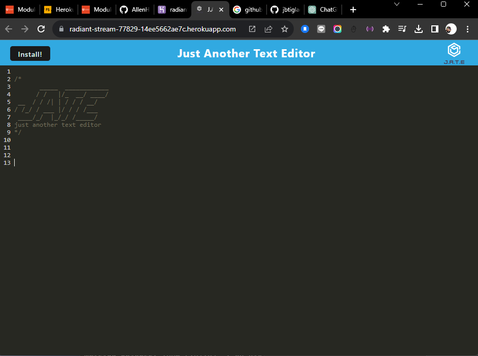

# Text Editor Starter Code

This text editor operates within a browser as a single-page application, complying with Progressive Web App (PWA) standards. It incorporates multiple data persistence methods to ensure redundancy in case a specific option is unsupported by the browser. The editor is hosted on Heroku and can function seamlessly even when offline.

## GitHub Repo URL
[GitHub Repo URL](https://github.com/AllenHirmiz/Text-Editor-JATE)

## Website URL
[Heroku Application URL](https://radiant-stream-77829-14ee5662ae7c.herokuapp.com/)

## Website Contents
Single-page application where user is able to write code snippets 

## Installation
Clone my repository on GitHub.
  
  To install the application's `dependencies` and `devDependencies`, run:
  ```
  npm install
  ```
  
  To invoke the application, run:
  ```
  npm run start
  ```

  ### Features and Functionalities
  
  This application is developed to allow users to create notes or code snippets with or without an internet connection, so users can reliably retrieve them for later use. It follows the features and functionalities required in the Assignment's README:
  
  1. When the user opens the application in the user's editor, the user will see a client server folder structure.
  
  2. When the user runs `npm run start` from the root directory, the application starts up the backend and serve the client.
  
  3. When the user runs the text editor application from my terminal, the user will find that the application's JavaScript files have been bundled using webpack.
  
  4. When the user runs the webpack plugins, the user will find a generated HTML file, service worker, and a manifest file.
  
  5. When the user uses next-gen JavaScript in the application, the text editor still functions in the browser without errors.
  
  6. When the user opens the text editor, the user will find the IndexedDB has immediately created a database storage.
  
  7. When the user enters content and subsequently clicks off of the DOM window, the content in the text editor is saved with IndexedDB.
  
  8. When the user reopens the text editor after closing it, the content in the text editor has been retrieved from the IndexedDB.
  
  9. When the user clicks on the Install button, the application is downloaded as an icon on the user's desktop.

  10. When the user loads the application, the user can register a service worker using workbox.

  11. When the user registers a service worker, the user's static assets are pre cached upon loading along with subsequent pages and static assets. 
  
  12. When the user deploys to Heroku, the user has a proper build scripts for a webpack application. 

# Screenshots
## Vscode
To run the app using terminal, first we need to use `npm i` to install, then `npm run start` to run and build the app.


## Heroku Application Page
The following screenshot is how the application display after deploying it on heroku.

